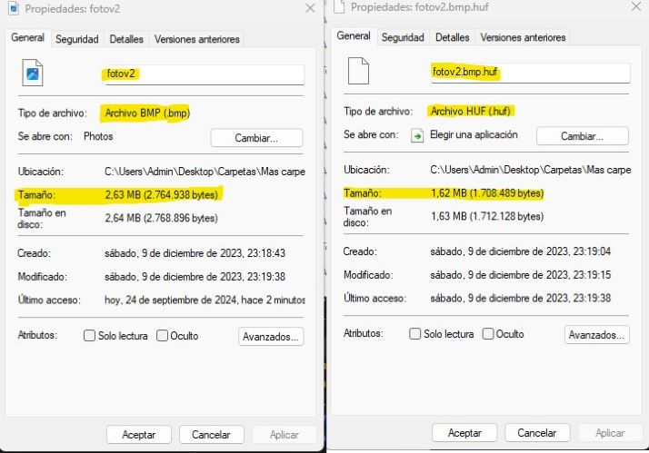
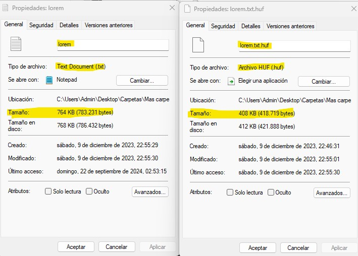

# Algoritmo de Huffman

Este proyecto implementa el **Algoritmo de Huffman**, un método de compresión sin pérdida que optimiza la codificación de caracteres según su frecuencia de aparición, permitiendo reducir el tamaño de archivos de texto.

## Descripción

El **Algoritmo de Huffman** es una técnica de compresión basada en la frecuencia de los caracteres presentes en un archivo. Asigna códigos más cortos a los caracteres que aparecen con mayor frecuencia y códigos más largos a los caracteres que aparecen con menos frecuencia. De esta manera, el algoritmo permite optimizar el almacenamiento y la transmisión de datos.

El algoritmo sigue estos pasos:
1. Construcción de un árbol binario de Huffman basado en las frecuencias de los caracteres.
2. Generación de códigos binarios para cada carácter.
3. Codificación del texto original utilizando los códigos generados.
4. Decodificación del archivo comprimido para restaurar el texto original.

## Características

- **Codificación eficiente:** Minimiza el tamaño del archivo mediante la creación de códigos binarios basados en frecuencias de los caracteres.
- **Decodificación exacta:** Restaura los archivos comprimidos sin pérdida de información.
- **Manejo de archivos de texto**: El algoritmo puede trabajar con archivos de texto para generar su versión comprimida.
- **Interfaz simple**: El programa permite ingresar archivos de texto y producir archivos comprimidos, así como descomprimirlos.

## Ejemplos

 **BPM**:

**TXT**:

## Aclaración
  - **Librerias personalizadas:** Las librerias utilizadas son funciones o TADs propios. Se encuentran disponibles en mis repositorios.

